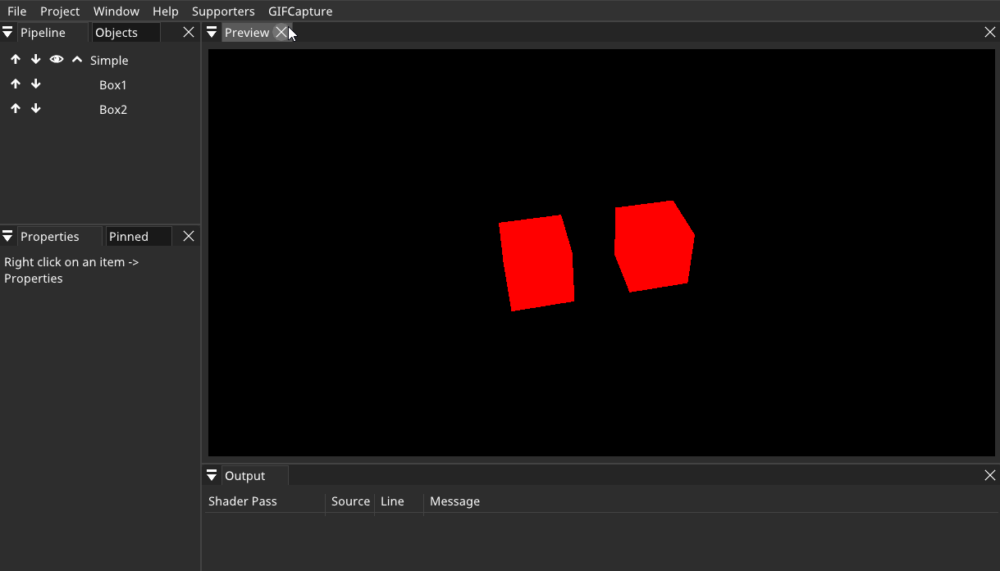

# GIFCapture
SHADERed plugin that adds the ability to capture GIF


You can change output path, width and height + hide the SHADERed logo in the properties/options.

## How to build
Clone the project:

```bash
git clone https://github.com/dfranx/PluginGIFCapture.git
git submodule init
git submodule update
```

Build:

```bash
cmake .
make
```

## How to install
Minimum requirements: SHADERed v1.3.5
Copy the .dll/.so file to plugins/GIFCapture in SHADERed's installation directory.
